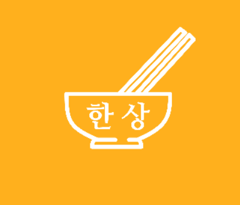

<head>
<link rel="preconnect" href="https://fonts.googleapis.com">
<link rel="preconnect" href="https://fonts.gstatic.com" crossorigin>
<link href="https://fonts.googleapis.com/css2?family=Nanum+Gothic+Coding&display=swap" rel="stylesheet">
</head>
<div id="header" align="center">
<h1>Hang Sang</h1>

<br>

<font size=3><b>한-상이 여러분들의 메뉴 고민을 해결할게요!</b></font><br>

식품의약품안전처에서 제공하는 건강한 <a href="https://www.foodsafetykorea.go.kr/api/openApiInfo.do?menu_grp=MENU_GRP31&menu_no=661&show_cnt=10&start_idx=1&svc_no=COOKRCP01">레시피</a>로<br>
매일 영양가 있는 한국인의 밥상을 차려드세요 🍳 <br>

한-상은 tflite를 활용 하여 식료품 목록을 인식하는 객체 인식 기반 레시피를 안내합니다.<br>
더 나아가 맞춤 레시피 추천 기능을 도입하기 위해<br>
TF-IDF 와 협업 필터링을 이용해 사용자 맞춤 레시피를 제공합니다.
</div>

<br>

<h2>목차</h2>
<ol>
    <li><a href="#index01">개요</a></li>
    <li><a href="#index02">개발팀 소개</a></li>
    <li><a href="#index03">배포 주소</a></li>
    <li><a href="#index04">프로젝트 소개</a></li>
    <li><a href="#index05">화면 구성</a></li>
    <li><a href="#index06">아키텍처</a></li>
</ol>

<br>

<div id="index01">
<h2>📌 개요</h2>
<ul>
    <li>프로젝트 이름: 한-상, 한국인의 밥상 🍚</li>
    <li>개발 기간 : 2023.09 ~ 2023.11</li> 
    <li>개발 엔진 및 언어: Flutter & Spring Boot</li> 
    <li>개발팀 : 졸업시켜조</li> 
</ul>
</div>

<br>

<div id="index02">
<h2>👯 개발팀 소개</h2>

<table>
<tr>
    <th scope="col" colspan="2">Back</th>
    <th scope="col" colspan="2">Front</th>
</tr>
<tr align="center">
    <td>민정윤</td>
    <td>양유정</td>
    <td>이호욱</td>
    <td>조윤희</td>
</tr>
<tr>
    <td></td>
    <td></td>
    <td></td>
    <td></td>
</tr>
<tr align="center">
    <td><a href="https://github.com/YuneeeM">@YuneeeM</a></td>
    <td><a href="https://github.com/thangyou">@thangyou</a></td>
    <td><a href="https://github.com/">@</a></td>
    <td><a href="https://github.com/">@</a></td>
</tr>
<tr align="center">
    <td colspan="4">부경대학교 컴퓨터공학과 4학년</td>
</tr>
<tr>
    <td></td>
    <td></td>
    <td></td>
    <td></td>
</tr>
</table>

<br>

<div id="index03">
<h2> ️️🖥️ 배포 주소</h2>

> **개발 버전** : [/]() <br>
> **프론트 서버** : [/]() <br>
> **백엔드 서버** : [/]() <br>

</div>

<br>

<div id="index04">
<h2>⚙️ 프로젝트 소개</h2>

<h3>1. Description</h3>

<h4> ⭐️ 이미지를 활용한 레시피 탐색 </h4>
<li> 객체 인식을 통해 식자재를 인식하고 레시피를 추천 </li>

<h4> ⭐️ 다양한 식재료 활용 방법 안내 </h4>
<li> 추후 지속적으로 레시피 추가 및 업로드 예정</li>
<li> 또한 사용자가 직접 레시피를 업로드</li>

<h4> ⭐️ 개인화된 레시피 추천 기능 </h4>
<li> 사용자가 원하는 식자재와 알러지 성분을 입력받아 TF-IDF를 고려해 레시피를 추천</li>
<li> 사용자가 남긴 리뷰 평점과 다른 사용자의 리뷰 평점을 고려해 협업필터링 기반 레시피 추천</li>

<br>
<h3>2. Requirements</h3>

For building and running the application you need:

- [Flutter - version -](https://flutter.dev/)
- [Spring boot 2.7.13](https://spring.io/blog/2023/06/22/spring-boot-2-7-13-available-now)
- []()

<br>
<h3>3. Installation</h3>

``` bash
$ git clone https://github.com/YuneeeM/MealRecipe.git
$ cd MealRecipe
```

<h4> Backend </h4>

```bash
$ 
$ 
```

<h4> Frontend </h4>

```bash
$
$
```

<h4> Flask </h4>

```bash
$ pip install flask
$ pip install flask-restx
```

<br>
<h3>4. Stacks</h3>

<h4> Environment </h4>


<h4> Development </h4>


<h4> Communication </h4>


</div>

<br>

<div id="index05">
<h2>📱 화면 구성</h2>
<table>
<tr>
    <th>시작 페이지</th>
    <th>로그인 페이지</th>
    <th>회원가입 페이지</th>
    <th>마이 페이지</th>
</tr>
<tr align="center">
    <td> </td>
    <td> </td>
    <td> </td>
    <td> </td>
</tr>
<tr>
    <th >추천 페이지</th>
    <th colspan="3">선호 식자재 및 알러지 맞춤 레시피 추천</th>
</tr>
<tr align="center">
    <td> </td>
    <td> </td>
    <td> </td>
    <td> </td>
</tr>
<tr>
    <th colspan="2" >식자재 인식 페이지</th>
    <th colspan="2">협업필터링 기반 맞춤 레시피</th>
</tr>
<tr align="center">
    <td> </td>
    <td> </td>
    <td> </td>
    <td> </td>
</tr>
<tr>
    <th colspan="3" >레시피 페이지</th>
    <th >리뷰</th>
</tr>
<tr align="center">
    <td> </td>
    <td> </td>
    <td> </td>
    <td> </td>
</tr>
<tr>
    <th colspan="3" >사용자 업로드 레시피 페이지</th>
    <th >찜 페이지</th>
</tr>
<tr align="center">
    <td> </td>
    <td> </td>
    <td> </td>
    <td> </td>
</tr>


</table>

</div>

<br>

<div id="index06">
<h2>🔎 아키텍쳐</h2>

```bash
├── README.md
├── build.gradle
├── gradlew
├── hangsang-backend : 
│   ├── auth 
│   │   ├── model
│   │   │   ├── KakaoOauthToken
│   │   │   ├── KakaoProfile
│   │   │   └── PostKakaoReq
│   │   ├── OAuthController
│   │   ├── OAuthRepository
│   │   └── OAuthService
│   ├── config 
│   │   ├── exception
│   │   │   ├──
│   │   │   ├──
│   │   │   ├── 
│   │   │   └── 
│   │   ├── MD5Generator
│   │   ├── SecurityConfig
│   │   └── SwaggerConfig
│   ├── controller
│   │   ├── BoardController : 게시판
│   │   ├── CommentController : 댓글
│   │   ├── LikeController : 저장, 찜
│   │   ├── RecipeController : 레시피
│   │   ├── RecommendController : 추천 시스템
│   │   ├── ReviewController : 리뷰
│   │   └── UserController : 사용자
│   ├── model
│   │   ├── DTO
│   │   └── Entity
│   ├── repository
│   ├── service
│   └── utils
│       ├── JwtService
│       ├── SHA256
│       └── ValidationRegex
│   ├── MealRecipeApplication
│   ├── WebSecurityConfig
│   ├── resources
│       └── application.yml
└── hangsang-front : 
    ├── README.md
    ├── component
    
```

</div>
</div>
